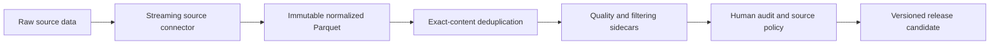

# Security Corpus

Security Corpus is a research pipeline for building a high-quality
cybersecurity continued-pretraining corpus. It converts heterogeneous security
data into self-contained plain-text documents with stable identifiers,
queryable quality features, exact content hashes, reference token counts,
provenance, and per-record license metadata.

The corpus is designed for mid-training an existing base language model rather
than instruction tuning. Source structure is preserved where it carries useful
signal: Q&A threads retain accepted answers and code blocks, Sigma records
retain complete YAML rules, CloudTrail records retain ordered JSON events, and
academic papers retain normalized LaTeX or extracted PDF text.

## Current corpus inventory

The current research checkpoint contains **2,089,231 documents** and
**2,703,091,696 `cl100k_base` reference tokens** across three source families.

| Family | Documents | Tokens | Current stage |
|---|---:|---:|---|
| Q&A and security communities | 1,617,344 | 1,128,832,782 | Exact-unique Qwen filtering universe |
| Academic full text | 63,291 | 1,299,113,085 | Exact-unique full-text checkpoint |
| Structured knowledge and artifacts | 408,596 | 275,145,829 | Structurally validated checkpoint |
| **Total** | **2,089,231** | **2,703,091,696** | **Pre-release working set** |

These are checkpoint counts, not the final Hugging Face release size. Final
counts will be lower after semantic filtering, paper reprocessing,
cross-family duplicate resolution, CloudTrail chunking, researcher policy
decisions, and redistribution review.

### Q&A and community sources

| Source | Documents | Tokens | Content shape |
|---|---:|---:|---|
| Stack Overflow security-tagged threads | 1,210,422 | 796,569,117 | Question with assembled answers |
| Stack Exchange: Information Security, Cryptography, Reverse Engineering, and Tor | 114,515 | 80,184,150 | Question with assembled answers |
| 23 security-focused Reddit communities | 292,407 | 252,079,515 | Submission with threaded comments |
| **Q&A total** | **1,617,344** | **1,128,832,782** | Exact-content deduplicated |

HTML from Stack Exchange is converted to Markdown while preserving code
blocks, inline code, links, lists, and answer structure. Reddit comment trees
are rendered with nested blockquotes up to a configured depth. Every record in
this family is evaluated by the pinned Qwen filtering pipeline; community
scores remain features rather than hidden hard thresholds.

### Academic sources

| Source stage | Documents | Tokens |
|---|---:|---:|
| arXiv `cs.CR` seed papers | 46,273 | 928,464,805 |
| Citation-expanded selected papers | 17,067 | 370,842,068 |
| **Exact-unique academic total** | **63,291** | **1,299,113,085** |

The citation expansion produces a broader 118,664-record exact-unique
title-and-abstract universe. Qwen scores that universe before full-text
download and extraction so expensive processing is reserved for accepted
papers. The source normalizer safely expands archives, deterministically
selects the main document, resolves nested LaTeX includes, records extraction
diagnostics, and supports PDF-only submissions.

### Structured knowledge and artifact sources

| Source | Documents | Tokens | Content |
|---|---:|---:|---|
| NVD | 343,260 | 26,714,714 | CVE descriptions and severity metadata |
| CISA Known Exploited Vulnerabilities | 1,568 | 55,045 | Exploited vulnerability catalog entries |
| MITRE ATT&CK | 2,177 | 389,674 | Techniques, groups, software, mitigations, and tactics |
| MITRE CWE | 1,286 | 103,783 | Weakness definitions and relationships |
| MITRE CAPEC | 556 | 68,938 | Attack patterns and mitigations |
| Sigma | 3,706 | 1,678,011 | Detection-rule descriptions and full YAML |
| flaws.cloud CloudTrail | 56,043 | 246,135,664 | Sessionized, ordered AWS events |
| **Structured total** | **408,596** | **275,145,829** | Structurally validated, policy-neutral |

The structured checkpoint removes malformed or structurally invalid records
but does not apply undocumented quality thresholds. Exact duplicate groups are
reported for researcher review rather than silently discarded.

## High-level design



The pipeline follows several design rules:

- **Quality over volume.** Obvious garbage is rejected early; substantive
  quality decisions remain auditable and reversible.
- **Immutable normalization.** Filtering never overwrites source-normalized
  Parquet. Decisions are stored in sidecars keyed by
  `(source_id, record_id, content_hash)`.
- **Streaming first.** Large XML, JSON, compressed JSONL, and archive sources
  are streamed instead of loaded fully into memory.
- **Training-ready documents.** Graph and thread sources are assembled during
  ingestion so downstream training does not require source-specific joins.
- **Reproducible filtering.** Qwen results store the full model name, immutable
  model commit, prompt version, inference configuration, timestamp, parse
  status, decision, and raw response.
- **Auditable deduplication.** Every document has a SHA-256 content hash.
  Duplicate maps and canonical-record choices are emitted as artifacts.
- **License-aware release.** Every record carries a license label, and the
  release audit blocks unknown, restricted, or attribution-incomplete groups.

## Filtering strategy

Filtering is separated into layers so expensive source ingestion does not need
to be repeated for every experiment:

1. **Scope filtering** removes structurally out-of-scope records such as
   deleted posts, revoked knowledge-base objects, unsupported rules, and empty
   documents.
2. **Normalization** computes canonical text, token counts, content hashes,
   source metadata, and source-family quality features.
3. **Exact deduplication** builds a deterministic universe without losing the
   duplicate-to-canonical mapping.
4. **Semantic filtering** applies pinned Qwen prompts to every exact-unique
   Q&A record and to citation-paper abstracts.
5. **Human audit** samples every source × keep/drop stratum deterministically
   and records reviewer labels and agreement without inventing an automatic
   acceptance threshold.
6. **Release policy** applies researcher-approved source decisions, chunking,
   duplicate precedence, attribution, and redistribution constraints.

Numeric thresholds and source exclusions are explicit research decisions. The
code reports distributions and outliers but does not silently choose a corpus
policy.

## Data contract

All normalized documents share these columns:

| Column | Meaning |
|---|---|
| `source_id` | Stable source identifier |
| `source_record_id` | Identifier from the upstream source |
| `record_id` | Namespaced corpus identifier |
| `content` | Training document text |
| `title` | Optional document title |
| `content_length` | Token count using the packaged `cl100k_base` vocabulary |
| `content_hash` | SHA-256 of UTF-8 `content` |
| `published_at`, `ingested_at` | Source and pipeline timestamps |
| `source_url` | Upstream provenance URL |
| `license` | Per-record source license or `NOASSERTION` |

Source-family schemas add fields such as CVSS scores, CWE IDs, Q&A scores,
accepted-answer state, tags, arXiv authors and categories, Sigma rule metadata,
and CloudTrail session statistics. Parquet columns keep these features
queryable for filtering, stratification, and analysis.

## Repository layout

```text
src/ingest/connectors/   source readers, assembly, and normalization
src/classify/            Qwen prompts, parsers, and sidecar schemas
scripts/arxiv/           metadata, download, extraction, and selection stages
scripts/classify/        universe construction and Qwen scoring
scripts/release/         coverage, human-review, and license release gates
scripts/ingest.py        source ingestion command line
tests/                   fixture-based unit and data-quality tests
config/                  machine-readable source release policies
docs/                    filtering and licensing documentation
```

## Installation

Python 3.11 or newer is required.

```bash
python -m venv .venv
source .venv/bin/activate
python -m pip install -e ".[dev]"
pytest
```

Install the GPU filtering dependencies separately on a compatible CUDA system:

```bash
python -m pip install -e ".[qwen]"
```

Runtime dependencies are pinned in `pyproject.toml`. The `cl100k_base`
vocabulary is packaged in the repository with a recorded SHA-256 digest so
reference token counts do not require a runtime network download.

## Core workflows

List available ingestion commands:

```bash
python scripts/ingest.py list
```

Build the policy-neutral structured checkpoint and exact-unique filtering
universes:

```bash
python scripts/build_structured_checkpoint.py --overwrite
python scripts/classify/build_qa_qwen_universe.py --overwrite
python scripts/classify/build_citation_qwen_universe.py --overwrite
```

Render Qwen prompts without importing vLLM or loading model weights:

```bash
python scripts/classify/score_qwen_vllm.py \
  --input data/filtering/v4/qa_to_score \
  --task qa \
  --qa-sources \
  --dry-run \
  --max-records 100
```

After scoring, merge sidecars and prove complete one-to-one coverage:

```bash
python scripts/classify/merge_qwen_sidecars.py \
  --input-dir data/filtering/v4/qwen_qa_shards \
  --output data/filtering/v4/qwen_qa_decisions.parquet

python scripts/release/audit_qwen_coverage.py \
  --corpus data/filtering/v4/qa_universe \
  --decisions data/filtering/v4/qwen_qa_decisions.parquet \
  --expected-model Qwen/Qwen3-8B \
  --expected-revision b968826d9c46dd6066d109eabc6255188de91218
```

Audit exact files proposed for publication:

```bash
python scripts/release/audit_source_licenses.py PATH [PATH ...] \
  --output reports/release/source_license_audit.json
```

See [`docs/filtering.md`](docs/filtering.md) for the complete filtering
protocol and [`docs/source_licenses.md`](docs/source_licenses.md) for the
source-specific publication boundary.

## Release status

This repository currently represents a research checkpoint, not a published
dataset release. A release candidate is produced only after Qwen coverage and
human review pass, academic sources are normalized with the current extractor,
source-specific policies are resolved, and the exact candidate passes schema,
hash, token-count, provenance, deduplication, and license audits.

The corpus does not have one blanket data license. Any public dataset must
preserve per-record license and attribution metadata and may contain a smaller
source set than the internal research corpus.
